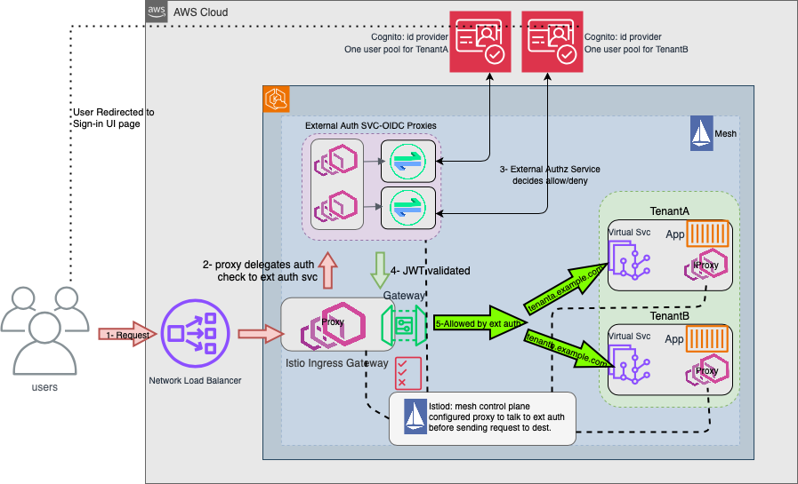
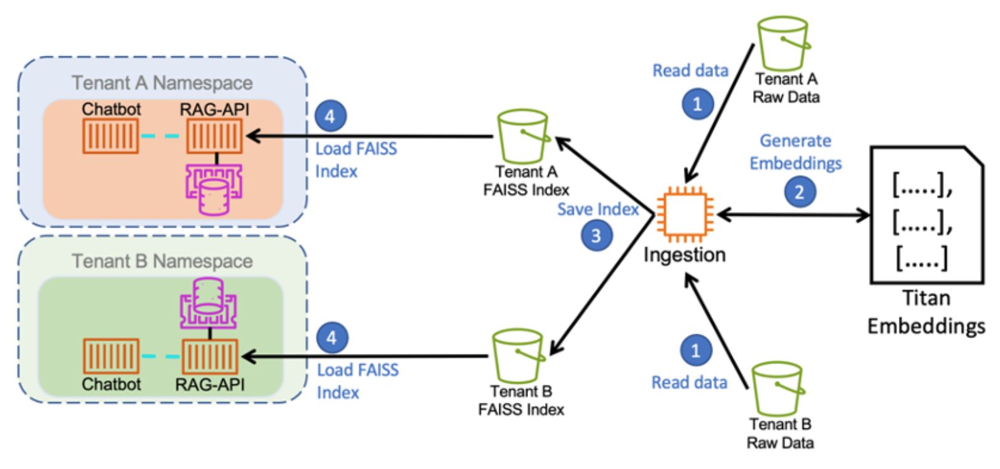

# Multi-tenant Applications on EKS

This project uses AWS CDK to deploy a soft multi-tenant application solution on Amazon EKS with Kubernetes namespaces serving as a logical unit of compute workload per tenant.
The solution uses [Istio](https://istio.io/latest/) which is an open-source service mesh commonly used with Kubernetes for deploying multi-tenant applications. It also provides features such as traffic management, security, and observability at the pod level.

We have used Istio service mesh for ingress control and routing functions as it supports external authorization, JWT validation at the edge, and request routing based on various HTTP parameters. We use an Open ID Connect (OIDC) proxy to relay authorization requests to an Identity Provider which in our case is Amazon Cognito User Pools. Requests from clients are received through a Network Load Balancer (NLB). The NLB forwards all traffic to an Istio Ingress Gateway. Cert-manager is used for creating and manging certificates. Kubernetes CSR API is used to show how to integrate custom CAs for signing mtls communications between workloads by possibly different CAs.

This project is my attempt based on [this](https://aws.amazon.com/blogs/containers/build-a-multi-tenant-chatbot-with-rag-using-amazon-bedrock-and-amazon-eks/) resource to use AWS CDK to fully automate application deployment on K8s (instead of using aws cli) just for learning purposes.

## Architecture

Here is a schema of how traffic flows in the cluster.

The general goal here is to move the application-based routes resolution, authorization, and authentication to a proxy that can resolve these mapping issues in a more natural and maintainable way.

Each tenant’s microservices are deployed into a Kubernetes namespace. With every service deployment, Kubernetes creates a name record in the internal DNS, as `<service-name>.<namespace-name>.svc.cluster.local`, which becomes the service endpoint referred to by the microservice and the Istio VirtualService construct. Routing rules are defined for each VirtualService based on host name, URL path, and other header information, thereby mapping requests that match to backend microservices. Network traffic at the edge is directed by Istio Ingress Gateway which is associated with a Network Load Balancer exposing virtual services to the world. Network Load Balancer acts as a transparent pass through (tls terminated at istio gateway not NLB).   The Envoy Proxy, defined as an External Authorizer, receives the requests from the Ingress Gateway, transparently fanning out each request to an up stream OIDC proxy instance matching the host name in the request header.

Each tenant that signs up for our SaaS service is associated with a single Amazon Cognito user pool. We also create an app client per pool, and a domain for sign in with Cognito Hosted UI. On successful authentication, Amazon Cognito issues JSON Web Tokens (JWTs) encapsulating user claims. Every user pool is associated with a domain which identifies the Hosted UI for OAuth 2.0-based authorization flows. 

## Application: Chatbot + RAG

The application code builds a simple GAI chatbot with RAG hosted using AWS Bedrock API wrapped by FastAPI that formats the prompt, adds history conversation. [FAISS](https://github.com/facebookresearch/faiss) is used as efficient similarity search and storage for dense vectors (or PostgresSQL, OpenSearch for production, for example) and Amazon DynamoDB for storing history messages. LangChain is used for formatting user messages combined with RAG mechanism to be fed into a LLM model on Amazon Bedrock.

The ingestion mechanism uses LangChain’s CharacterTextSplitter to chunk the ingested data into reasonable sizes, and the FAISS library converts each of the chunks into a vector embedding by calling the Titan embeddings model, creating an index of the embeddings. This indexing improves the response time for similarity search. The set of indexes so created are output in a binary formatted file and uploaded back into the Amazon S3 bucket, which is accessed by the RAG-API microservice during bootstrap and loaded into its memory. With larger vector databases, the index is created and managed by the database instance and can be queried by the application using database-specific APIs. Having a dedicated vector database decouples the loading, updating, and indexing of context data from the application, as well as the scaling of the database instance.

## Deploy Infrastructure and Application

Run `cdk deploy --no-rollback` to deploy the infrastructure, two codebuild projects and outputs the nlb hostname. Manaually start codebuild projects to deploy configure and install ext auth as well as application pods into namespaces. 

Add Cognito users for tenants with desired passwords:

`bash create_cognito_users.sh`

Download the TLS self-singed root certificate from K8s cluster secret and have your browser trust it (using KeyChain Access for example on Mac) to have a secure connection when pointing a browser to the Fully Qualified Domain Name (FQDN) such as tenanta.example.com or tenantb.example.com 

`kubectl get -n istio-ingress secret gateway-ca-tls -ogo-template='{{index .data "tls.crt"}}' | base64 -d > ca.pem`

Obtain the public ip address of NLB hostname:
`nslookup <nlb-hostname>`

## CI/CD - GitOps
GitHub Actions are used for CI. A push for the app code results in a new image built. A new release of an image will trigger the CD process done by FluxCD. The components of CD pipeline including Flux, Flagger and laodtester, Prometheus are configured and installed during cloud infrastructure deployment. The base manifests are generated and push into Flux code repository. Using overlays, a customized version for tenants is deployed into the cluster. Flagger detects the new deployments and starts the progressive delivery. Flagger uses Prometheus and aggregated istio metrics to load test the new canary deployments while diverting traffic incrementally to it. If tests passed, the canary deployment is promoted to recieve 100% traffic, otherwise a rollback will occur.

